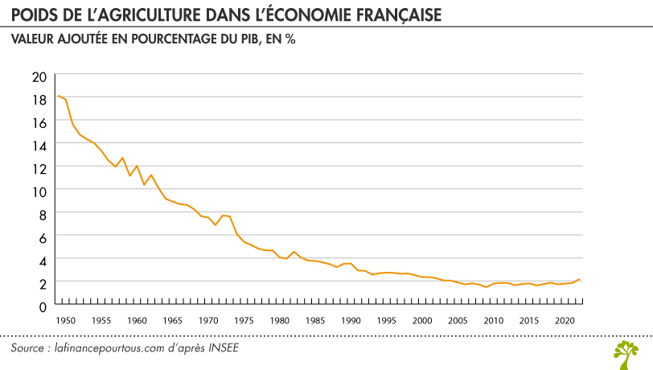
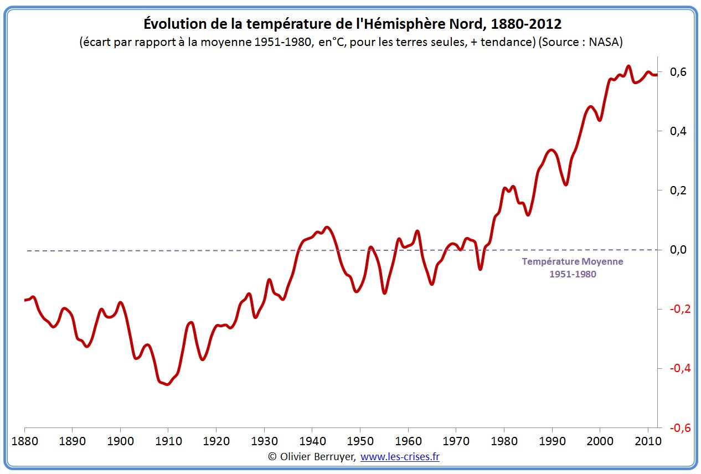
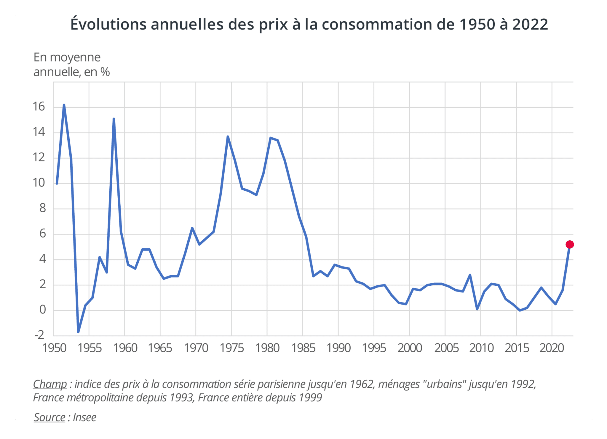

#3 visualisations dans le temps

**Santatriniaina RASOLOFOMANANA - BUT3FA VCOD - Groupe 33**

##Graphique 1: le poids de l’agriculture dans l’économie française

**Source de données :** https://www.lafinancepourtous.com/decryptages/entreprise/secteurs-dactivites/le-secteur-agricole-en-france-une-vue-densemble/

Ce premier graphique couvre environ 72 ans, de 1950 à 2022. 
Il montre la valeur ajoutée de l’agriculture en pourcentage du PIB, avec des données de l’Insee reprises par La finance pour tous. 
En 1950, l’agriculture pèse environ 18 % de la richesse produite en France. 
Ensuite, la baisse est très rapide car on passe sous les 10 % au début des années 1960, puis autour de 4 % à la fin des années 1970. 
À partir des années 1990, la courbe s’aplatit, et depuis le milieu des années 2000 on reste stable, autour de 2 %. 
La courbe est le bon choix ici, parce qu’on veut montrer une évolution sur le long terme : elle fait ressortir la tendance de la transformation de l’économie française, qui passe d’un pays encore très agricole à une économie dominée par l’industrie et les services.

##Graphique 2: la température de l’hémisphère Nord

**Source de données :** https://www.les-crises.fr/climat-6-rechauffement-global/

Le second graphique présente l’évolution de la température sur plus de 130 ans, de 1880 à 2012. 
Chaque année est comparée à une température de référence, la moyenne de 1951 à 1980, représentée par la ligne en pointillés à zéro. 
Entre 1880 et 1940, les températures sont inférieures à cette référence, avec un point bas vers 1910, à environ -0,45 °C. 
Ensuite, elles fluctuent jusque dans les années 1970. 
À partir de cette période, la hausse devient rapide et presque continue : au début des années 2000, l’écart dépasse +0,6 °C. 
La courbe est lissée, ce qui efface les petites variations d’une année à l’autre pour ne garder que l’évolution générale.

##Graphique 3: l’inflation en France

**Source de données :** https://blog.insee.fr/un-retour-sur-l-evolution-recente-de-l-inflation/

Ce dernier graphique couvre lui aussi 72 ans, de 1950 à 2022. 
Il montre l’évolution annuelle des prix à la consommation, en pourcentage, d’après l’Insee. 
On distingue trois grandes périodes. D’abord les années 1950, très instables, avec des pics autour de 16 % et même une courte déflation. 
Ensuite les années 1970 et le début des années 1980, l’inflation dépasse 13 %. 
Puis, à partir du milieu des années 1980, une longue période de stabilité, autour de 2 % ou moins. 
Et tout à droite, le point rouge met en avant 2022, où l’inflation remonte brutalement à environ 5 %. La courbe est le bon choix, parce qu’on veut montrer une évolution dans le temps, et le point rouge attire le regard sur le message principal qui est le retour de l’inflation après des décennies de calme.
