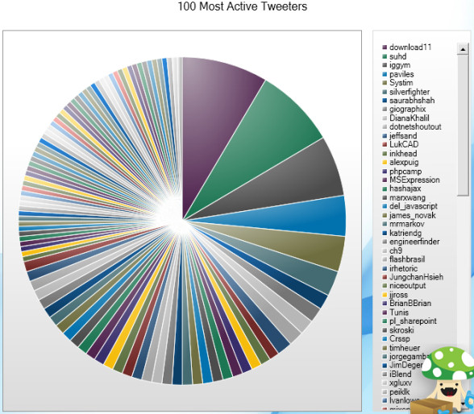
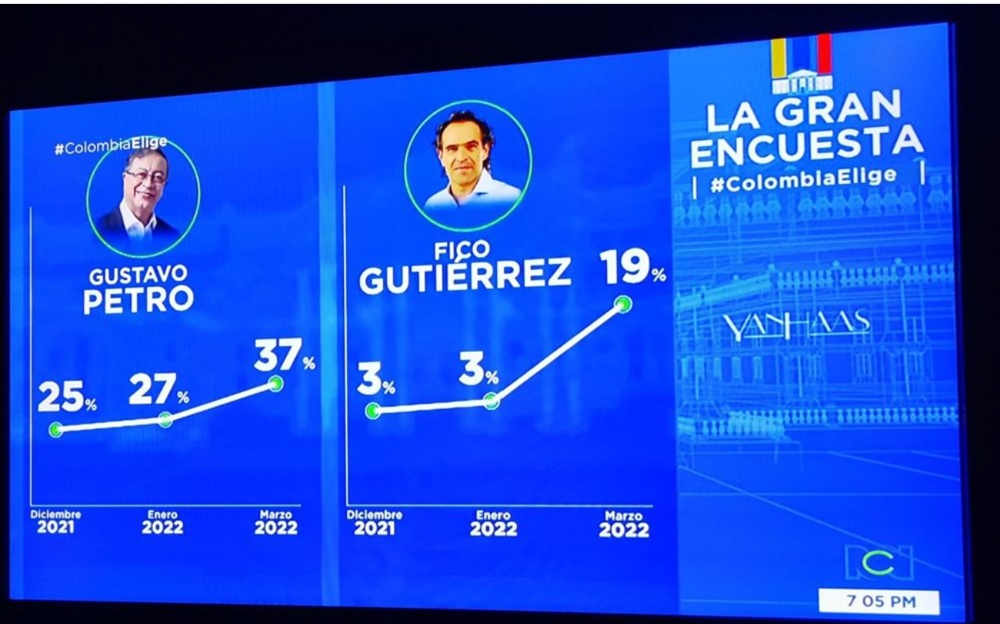
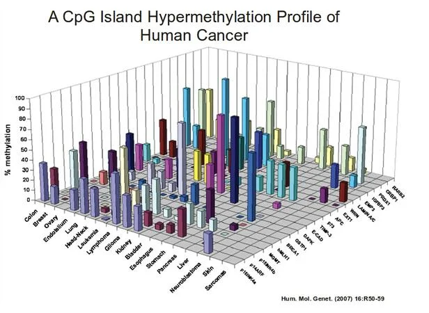

Voici trois mauvaises exemples de visualisation de données:

1) Diagramme en camembert des 100 tweeters les plus actifs

- SOURCE: Chandoo - article de ReWriteWeb intitulé “10 ways to archive your tweets”

- CE QUE LE GRAPHIQUE REPRESENTE:
  Il montre les 100 utilisateurs les plus actifs sur Twitter, chacun représenté par une tranche du camembert

- POURQUOI CE GRAPHIQUE N'EST PAS BON:
  Ce camembert est impossible à lire
  Il y a trop de catégories, les couleurs se répètent et les parts sont minuscules
  La légende est très longue et on ne sait pas à quelle part chaque catégorie correspond
  Donc on ne comprendra rien

- PRINCIPES NON RESPECTES:
  Lisibilité
  Intégrité

- COMMENT LE CORRIGER:
  Remplacer le diagramme en camembert par un diagramme en barre
  Pour ne pas charger le graphique, on pourrait juste afficher un top 10 ou top 20

2) Popularité de Gustavo Petro vs Fico Gutiérrez

- SOURCE: Graphique diffusé dans l’émission La Gran Encuesta – Colombia Elige

- CE QUE LE GRAPHIQUE REPRESENTE:
  Il montre l'évolution de la popularité de deux leaders politiques sur trois mois

- POURQUOI CE GRAPHIQUE N'EST PAS BON:
  On ne sait pas vraiment ce que le graphique mesure
  Les deux graphiques n'ont pas la même échelle (un 33% est placé plus haut qu'un 25%)
  Si on regarde juste les lignes, on croit que Fico est plus populaire que Petro, alors que ce n'est pas le cas, donc cette visualisation est trompeuse

- PRINCIPES NON RESPECTES:
  Complétude
  Intégrité

- COMMENT LE CORRIGER:
  On pourrait réaliser un graphique en lignes simple, avec les deux courbes sur le même axe
  On pourrait rajouter un titre clair comme "Evolution de la popularité (en %)"

3) Graphique 3D sur la méthylation des cancers

- SOURCE: Article Human Molecular Genetics (2007), 16:R50–59

- CE QUE LE GRAPHIQUE REPRESENTE:
  Il représente les niveaux de méthylation de différents cancers sur plusieurs régions avec des barres 3D

- POURQUOI CE GRAPHIQUE N'EST PAS BON:
  Il y a trop de variables et tout est mélangé
  L'affichage 3D ajoute de la confusion car certaines barres sont cachées, et les hauteurs sont faussées par la perspective
  On passe plus de temps à essayer de comprendre la forme qu'à lire les données

- PRINCIPES NON RESPECTES:
  Lisibilité

- COMMENT LE CORRIGER:
  On pourrait réaliser un diagramme en barre en 2D par type de cancer
